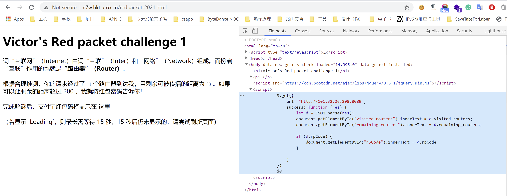

# 2021 辛丑年『解谜红包』 - Victor

## 题面

> 互联网（“Internet”）由词“互联”（Inter）和“网络”（Network）组成。而扮演“互联”作用的也就是“路由器”（Router）。
>
> 根据合理推测，你的请求经过了 11 个路由器到达我，且剩余可被传播的距离为 53 。如果可以让剩余的距离超过 200 ，我就将红包密码告诉你！
>

题目信息还包含网页的一小段 JavaScript 逻辑。

## 解法

背景：在 IP 网络中，数据的发送方会在 IP 报文头部设置 TTL （Time-To-Live）字段。

IP 报文在客户端发出后，经过每一个 IP 路由节点时，路由设备会将该报文中的 TTL 字段减去 1，接着：
- 如果减去 1 后 TTL 大于 0，则按既定规则将报文转发至下一台连接的路由器
- 如果减去 1 后 TTL 等于 0，则丢弃该包

参考 这篇文章 [^default_ttl_values] ，Windows 7 ~ Windows 10 的默认 TTL 为

[^default_ttl_values]: https://subinsb.com/default-device-ttl-values/

